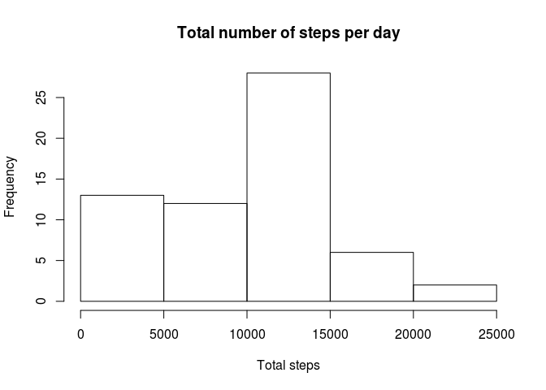

# Reproducible Research: Peer Assessment 1


## Loading and preprocessing the data

```r
dataFile <- "activity.csv"
# Unzip the file
if(!file.exists(dataFile)){
  unzip(zipfile="activity.zip")
}

# Read the csv into memory
data <- read.csv(dataFile)
```

## What is mean total number of steps taken per day?

```r
# Calculate the total of steps by date and exclude NA
steps.date.total <- tapply(data$steps, data$date, sum, na.rm=TRUE)

# Make a histogram of the of the total steps
hist(steps.date.total, main = "Total number of steps per day", xlab = "Total steps")
```

<!-- -->

```r
# Calculate the mean and the median
mean(steps.date.total)
```

```
## [1] 9354.23
```

```r
median(steps.date.total)
```

```
## [1] 10395
```


## What is the average daily activity pattern?

```r
# Average steps par interval
steps.interval.mean <- tapply(data$steps, data$interval, mean, na.rm=TRUE)

# Make a time series plot of the of the average number of steps
plot(
  names(steps.interval.mean), 
  steps.interval.mean, 
  type = "l", 
  main = "Average Steps by Interval", 
  xlab = "Interval",
  ylab = "Average steps"
)
```

<!-- -->

```r
# Highest 5-minute interval
steps.interval.mean[which.max(steps.interval.mean)]
```

```
##      835 
## 206.1698
```


## Imputing missing values

```r
# Total number of missing values
sum(is.na(data))
```

```
## [1] 2304
```

```r
# Fill in the missing values with mean in a new dataset
data.imputed <- data 
steps.date.mean <- tapply(data$steps, data$date, mean, na.rm = TRUE)
data.na <- is.na(data$steps)
head(steps.date.mean)
```

```
## 2012-10-01 2012-10-02 2012-10-03 2012-10-04 2012-10-05 2012-10-06 
##        NaN    0.43750   39.41667   42.06944   46.15972   53.54167
```

```r
data.imputed$steps[data.na] <- steps.date.mean[data$date[data.na]]
# This produces NaNs in dates without any data.
#data.imputed$steps[is.nan(data.imputed$steps)] = 0

# Calculate the total of steps by date
imputed.steps.date.total <- tapply(data.imputed$steps, data.imputed$date, sum)

# Make a histogram of the of the total steps
hist(
  imputed.steps.date.total, 
  main = "Total number of steps per day with imputed data", 
  xlab = "Total steps"
)
```

<!-- -->

```r
# Calculate the mean and the median
mean(imputed.steps.date.total)
```

```
## [1] NaN
```

```r
median(imputed.steps.date.total)
```

```
## <NA> 
##   NA
```


## Are there differences in activity patterns between weekdays and weekends?
